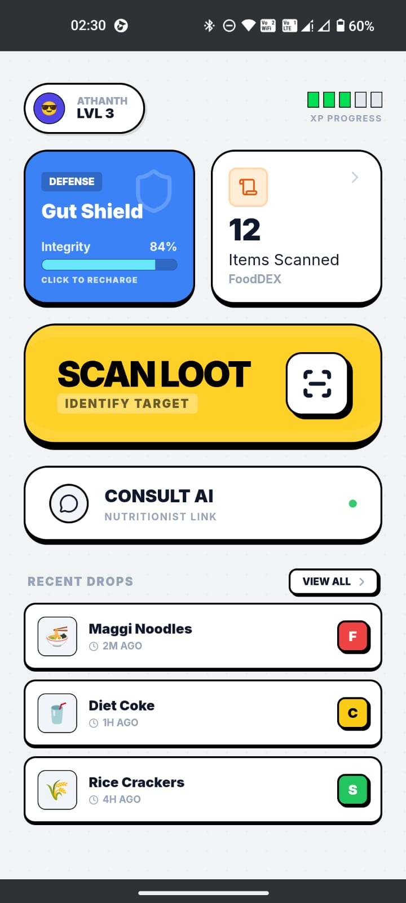
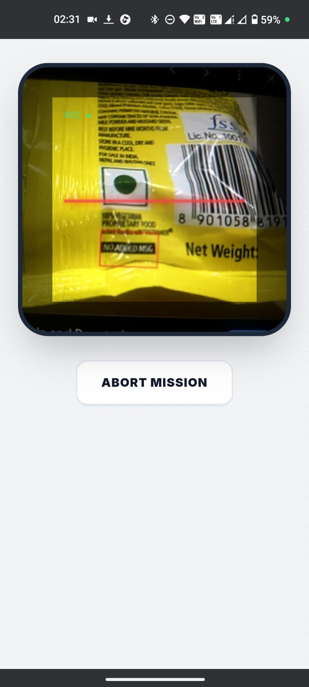
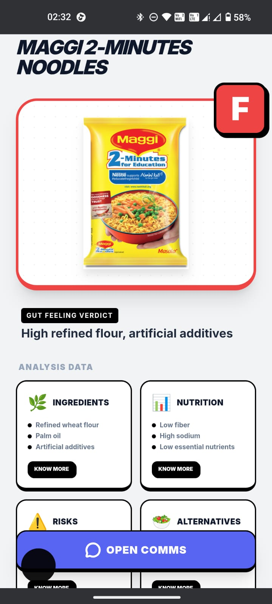
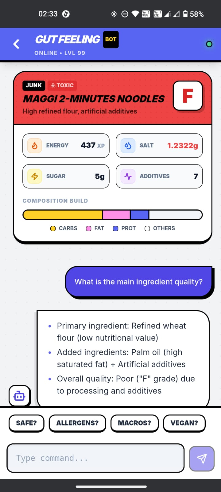

# Gut Feeling (v1.0)

**Gut Feeling** is a gamified, high-performance nutritional analysis engine designed to turn the "boring" task of reading food labels into an interactive RPG experience. By leveraging the **Open Food Facts API** and state-of-the-art **Open Source Large Language Models**, we provide brutal, honest, and instant feedback on your food choices.

---

## Live Demo

Experience the "Oracle" in real-time: [www.gut-feeling.netlify.app](https://www.google.com/search?q=https://www.gut-feeling.netlify.app)

---

## The Philosophy: Open Source & Open Data

This project is built on the belief that nutritional clarity is a human right, and the tools to achieve it should be private, affordable, and transparent.

### Data Safety & Sovereignty

By utilizing **Open Source LLMs** (such as Meta’s **Llama 3.3** and Alibaba’s **Qwen 2.5**), we ensure that your health queries aren't feeding into a closed corporate "black box."

* **No Ad Tracking:** Your food habits are used only for your analysis, not for building an advertising profile.
* **Model Transparency:** Open-source models allow us to verify the "personality" and logic of our AI nutritionist, ensuring it remains unbiased by corporate food lobbying.

### Cost Efficiency

Proprietary models (like GPT-4) charge a premium for "brand name" intelligence. By using Open Source models via inference providers like DeepInfra, we achieve **90% cost reduction** while maintaining the same "reasoning" quality. This enables a free-to-use experience for the community.

### Open Food Facts Integration

We fetch all raw product data from the **Open Food Facts API**, a "Wikipedia for food." It is a collaborative, community-driven database of 3 million+ products.

* **Global Access:** Data is sourced from volunteers worldwide.
* **Unbiased Info:** Unlike brand-owned websites, this data is verified by users.

---

## Psychological Mechanics: Haptic Conditioning

We don't just *tell* you the food is bad; we make you *feel* it.

### Negative Haptic Reinforcement

When the Oracle detects a "Junk" item (Grade D or F), the app triggers a specific, jarring vibration pattern (High-Low-High discordance).

* **The Concept:** This utilizes **Operant Conditioning**. By associating "bad" food with an unpleasant physical sensation (a rough vibration), we subtly condition the user to feel a micro-aversion to that product.
* **Scientific Basis:** Research in **Affective Haptics** demonstrates that haptic feedback can directly influence emotional valence and arousal, effectively acting as a non-verbal warning signal that bypasses cognitive processing.
> *Reference:* **Eid, M. A., & Al Osman, H. A. (2016). "Affective Haptics: Current Research and Future Directions." IEEE Access.** This research highlights how haptic stimuli serve as a powerful modality for emotional communication and behavioral modulation.


---

## App Walkthrough & Screens

### 1. Home HUD (Heads-Up Display)

The entry point to your health journey. Designed as a game dashboard, it features:

* **Player HUD:** Redesigned top bar showing your **Level** and a segmented **XP Progress Bar**.
* **System Status Card:** A real-time diagnostic tile with an **animated heartbeat line**. Click it to run a fake "System Optimization."
* **Gut Shield (Armor):** An interactive integrity bar. If you’ve been eating poorly, your shield "takes damage." Click it to trigger a "Recharge" animation.
* **Inventory (Loot Log):** A scrollable list of your **Recent Drops**. Each item shows a thumbnail and its color-coded Grade Badge (S, C, F).

### 2. Scanner (The Loot Sensor)

A retro-styled barcode interface that uses your device's camera.

* **Retro Overlay:** Features a sci-fi "REC" indicator and a pulsing red scan-line.
* **Tactile Feedback:** Vibrate patterns trigger when a barcode is successfully locked.

### 3. Result Card (The Item Appraisal)


The "Judgment" screen where the Oracle delivers the verdict.

* **Hero Image:** A large visual of the scanned product with a **Grade-Dependent Colored Border** (Red for F, Yellow for C, Green for S).
* **S-Tier Grading:** A prominent, floating grade badge in the top-right corner.
* **Brutal Reasoning:** A short, punchy explanation from the LLM (e.g., "Liquid Poison. 40g Sugar. Nerf immediately.")
* **Deep Dive Grid:** Four interactive tiles: **Ingredients, Nutrition, Risks, and Alternatives**. Each shows two sub-points (e.g., "3 Additives," "High Sodium") and a "Know More" button.

### 4. Oracle Chat (The Comms Link)


A Discord-inspired terminal to deep-dive into the data.

* **Visual Verdict Card:** A detailed RPG stat sheet inside the chat. It calculates the **Macro Split** (Carbs vs. Fat vs. Protein) and displays it as a health bar. It removes the "Grey Space" of traditional labels by showing exactly what makes up the product's mass.
* **Interactive Command Chips:** Quick-tap prompts like "🤰 Pregnant safe?" or "💪 Protein Stats?" to bypass typing.

---

## Technical Stack

* **Frontend:** React.js + Tailwind CSS (Tactile "Chunky" UI style).
* **Animations:** Framer Motion (Spring physics for button presses).
* **API:** Open Food Facts (Product sourcing).
* **LLM Orchestration:** OpenAI SDK (connecting to Llama 3.3 70B & Qwen 2.5 VL).
* **Icons:** Lucide-React.

---

## Installation & Setup

1. **Clone the Repository:**
```bash
git clone https://github.com/yourusername/gut-feeling.git
cd gut-feeling

```


2. **Install Dependencies:**
```bash
npm install

```


3. **Configure Environment Variables:**
Create a `.env` file in the root directory:
```env
REACT_APP_OPENAI_API_KEY=your_inference_api_key
REACT_APP_BASE_URL=https://api.deepinfra.com/v1/openai (or other provider)

```


4. **Run the Project:**
```bash
npm start

```


---

## Important Security Note

**Gut Feeling** is an educational tool. While the AI is trained on nutritional data, always consult a medical professional for serious dietary restrictions or allergies. **Your health is your highest-level stat - protect it.**

---

**Built for a healthier world.**
[Live Demo](https://www.google.com/search?q=https://www.gut-feeling.netlify.app) | [Open Food Facts](https://world.openfoodfacts.org/)